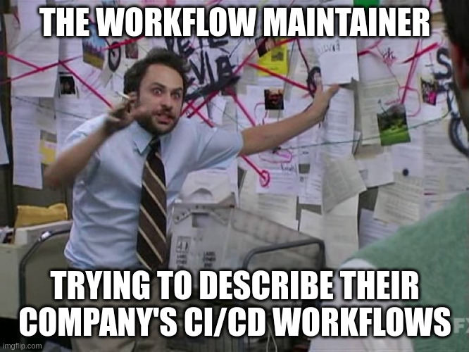

---

marp: true
theme: plato
_class: lead
class: default
header: Développement en Continue à Ouranos en ~5 minutes
footer: Présentations éclairs Ouranos
author: Trevor James Smith
paginate: true
backgroundColor: 
transition: fade
backgroundImage: url('https://marp.app/assets/hero-background.svg')
size: 16:9
style: |
  footer {
    left: 5%;
    right: 2.5%;
    font-color: white;
    font-size: 20px;
  }
  header {
    right: 5%;
    left: 5%;
    text-align: right;
    font-size: 20px;
  }
  img[alt~="center"] {
    display: block;
    margin: 0 auto;
  }
  .container{
    display: flex;
  }
  .column{
    flex: 1;
  }

---

<!-- _header: "" -->
<!-- _paginate: skip -->

# Développement / Déploiment continue à Ouranos en ~5 minutes

### Trevor James Smith
### Présentations éclairs Ouranos
### 12 Juin 2024

---

<!-- _header: "" -->
<!-- _footer: "" -->

## C'est quoi **Développement continue** ?

*ou « **Continuous Integration** »*

- Automatiser les tests des nouvelles contributions au code
- Appliquer les normes de qualité du code
- Fournir un retour d'information aux développeurs sur ce qu'ils doivent modifier
- Veiller à ce que la base de code fonctionne en permanence

## C'est quoi **Déploiement continue** ?

*ou « **Continuous Deployment** »*

- Automatiser les mises à disposition de logiciels versionnés
- Veiller à ce que les contributions au code soient rapidement et facilement mises à la disposition des utilisateurs

---

Quelques exemples des services de CI/CD:

- « **AppVeyor** »
- « **Azure Pipelines** »
- « **CircleCI** »
- « **Jenkins** »
  - Ouranos et CRIM roule des instances localement 
- « **GitHub Actions/Workflows** »
  - **La grande majorité de nos flux de travail CI/CD roule ici**
- « **GitLab CI/CD** »
  - Ouranos roule une instance localement
* « **Travis CI** »
  * *Aucun association avec Travis Logan, PCDO*

---

---

## L'expérience de décrire les pipelines de CI

Exemple simplifiée : `xclim`

---

<!-- _header: "" -->
<!-- _footer: "" -->

## <!-- fit --> « **Continuous Integration** »

* Le développeur envoie le code sur « *GitHub* ».
* Contrôles de qualité du code écrit
  * Des corrections automatiques sont effectuées (si possible)
* Étape de test des changements (matrice de configuration)
* Validation de la *couverture du code* et de la santé/sécurité de la librairie

---

<!-- _header: "" -->
<!-- _footer: "" -->

## <!-- fit --> « **Continuous Deployment** »

* Le mainteneur pousse un *tagged commit* qui décrit une version (par exemple `v1.2.3`).
* Un paquet est créé avec ce commit et placé sur le « *Python Package Testing Index* »
* Vérification du fonctionnement du paquet sur **testpypi.org**.
* Une « *release* » de la prochaine version est mise en place par le flux de travail.
* Le mainteneur donne le « *go* » pour finaliser la version.
* Le paquet est placé sur le véritable « *Python Package Index* ».

---

<!-- _header: "" -->
<!-- _footer: "" -->

<!-- Quand on met ça toute ensemble, on trouve la graphique ici -->

---

# Merci !

